# Computer-Use Automation Engine

A system that discovers workflows in UI-only applications and compiles successful interactions into typed capabilities that can later be replayed deterministically, without an LLM.

## Why this exists

Some line-of-business software has no API — the only way in is the UI a human operator uses. An LLM can figure out how to drive that UI once. But re-running an LLM for every future execution is slow, expensive, and non-deterministic, which is a bad foundation for reliable, auditable operations in sensitive enterprise systems.

This project separates those two concerns cleanly:

**Discovery may be provider-driven. Replay is deterministic.**

An agent observes a live page, decides what to do through a fixed, validated tool vocabulary, and acts through a browser-automation layer. A successful run is recorded and compiled into a typed, versioned **Capability** artifact — an ordered list of steps, each with a locator, a risk level, and typed parameters. From then on, that artifact runs through a **deterministic replay engine** with new inputs. No model, no provider, no network call to an LLM anywhere in that path.

The demo you can run right now (`npm run demo`) uses `DeterministicDemoProvider` — a fixed, deterministic script, no API key or reasoning model involved. `AnthropicLlmProvider` is available as an optional, real-model integration behind the same provider interface. Either way, `ReplayEngine` has no dependency on a model or provider at all.

## Core idea

```
Natural-language goal
        ↓
Provider-driven discovery  (probabilistic — a planner decides what to click)
        ↓
Typed Capability artifact  (compiled, versioned, persisted to disk)
        ↓
Deterministic replay  (no LLM — the same steps, new inputs, every time)
```

## Architecture

```mermaid
flowchart TD
    Goal["Natural-language goal"] --> Agent

    subgraph Discovery["Discovery — probabilistic"]
        Agent["DiscoveryAgent"] <--> Provider["Provider\n(Anthropic / deterministic demo)"]
        Agent --> Surface1["Surface"]
        Surface1 --> UI1["Live UI"]
        Agent --> Recorder["Recorder"]
    end

    Recorder --> Artifact[("Capability artifact\ntyped · versioned · on disk")]

    subgraph Replay["Replay — deterministic, zero LLM"]
        Artifact --> Engine["ReplayEngine"]
        Engine --> Surface2["Surface"]
        Surface2 --> UI2["Live UI"]
    end

    Guard["GuardrailPolicy"] -. checked before every action .-> Agent
    Guard -. checked before every action .-> Engine
    Handoff["HandoffSession /\nControl state machine"] -. escalation & approval .-> Agent
    Handoff -. escalation & approval .-> Engine
```



`LlmProvider` only ever appears on the discovery side. `ReplayEngine`'s constructor is `(surface, policy)` — there is no parameter to pass a provider into, so this isn't a convention being followed, it's a shape that can't be violated by accident. `GuardrailPolicy` and the escalation/handoff machinery are the same objects on both sides, not two parallel safety implementations.

## Engineering highlights

- **Surface abstraction** — Playwright is isolated behind one interface (`src/surface/`); nothing else in the codebase imports it.
- **`LogicalLocator` with deterministic, ranked fallback resolution** — role/name → label → text → attribute → scoped structural CSS, tried in order, with a `describe()` method that reverse-generates this same ranked chain from a live element.
- **Typed, versioned Capability artifact** — a Zod schema with typed value references (`{kind:"input_ref", name}`), not template strings; no interpolation, no `eval`, statically reviewable.
- **Deterministic `ReplayEngine`** — zero LLM dependency, verified structurally (no provider parameter exists) and by a source-level test that asserts it.
- **Structured result/error semantics** — business outcomes (e.g. `MEMBER_NOT_FOUND`) are declared per-capability and kept distinct from generic execution failures (`LOCATOR_NOT_FOUND`, `CHECKPOINT_FAILED`, …) owned by the engine.
- **Guardrail policy + human-in-the-loop approval** for irreversible actions, backed by a real control-state machine (`AUTOMATION_CONTROL` / `HUMAN_CONTROL` / `COMPLETED` / `FAILED`) and a redaction layer for anything a human types during a handoff.
- **93 automated tests**, including substantial integration coverage against a real Chromium browser and local target application.

## Quick start

```bash
git clone <this-repo>
cd computer-use-automation-engine

npm install
npx playwright install chromium

cd apps/mock-bank && npm install && cd ..
```

Run the test suite (spins up the mock app itself, nothing else to start):

```bash
npm test
```

## `npm run demo`

```bash
# terminal 1
npm --prefix apps/mock-bank run dev

# terminal 2
npm run demo
```

This runs the whole thesis end to end, against a real browser driving a real local server — no API key required. It demonstrates, in order:

1. **Discovery** against the live mock-bank UI: an agent (`DeterministicDemoProvider`) observes the page, fills the search form, opens a sub-account form, and reaches the final confirmation step — through the same `Surface`/`GuardrailPolicy` path a real model would use.
2. **Irreversible-action approval** — "Confirm & Open Account" is classified irreversible and does **not** execute automatically. The run pauses, prints the pending action, and waits for you to type `y`.
3. **Capability generation** — the actions actually taken are compiled by the `Recorder` into a draft `Capability` artifact.
4. **Persistence and reload** — the artifact is written to `evidence/discovery/demo/capability.json`, then **read back from disk** before being replayed, so what runs is provably what was saved, not an in-memory object.
5. **Deterministic replay with new inputs** — `ReplayEngine` runs that on-disk artifact twice:
   - a fresh deposit amount → **success**, with typed outputs (`new_account_number`, `confirmation_id`) — and the irreversible step is re-gated for approval independently, since replay enforces its own policy check rather than inheriting discovery's approval.
   - an unknown member id → a structured **`MEMBER_NOT_FOUND`** business outcome, not a crash.

No `LlmProvider`, no Anthropic SDK, and no network call to any model exists anywhere in that replay path — see `docs/architecture.md` for how that's enforced, not just intended.

### Optional: real LLM-backed discovery

```bash
ANTHROPIC_API_KEY=sk-ant-... npm run discover
```

This runs the identical `DiscoveryAgent`/`GuardrailPolicy`/`Recorder` pipeline, with `AnthropicLlmProvider` in place of `DeterministicDemoProvider` — both implement the same `LlmProvider` interface, which is the point: the provider is genuinely swappable, not hardcoded.

**Honesty note:** the demo's default provider is a fixed, deterministic script, not a reasoning model — it makes no claim to "decide" anything, and the evidence committed under `evidence/discovery/demo/` was produced by it, not by Anthropic. Running `npm run discover` with a real key produces its own, separate evidence.

## Project structure

```
apps/mock-bank/            legacy-style target app (Express, server-rendered, no test IDs) — what gets automated
src/
  locator/                  LogicalLocator + deterministic fallback resolution
  surface/                   Surface interface; PlaywrightBrowserSurface is the only file that imports Playwright
  artifact/                   Capability / TargetProfile schema (Zod) — depends on nothing else in this repo
  discovery/                   DiscoveryAgent, LlmProvider, AnthropicLlmProvider, DeterministicDemoProvider, Recorder
  replay/                       ReplayEngine — deterministic, no LLM dependency
  guardrails/                   GuardrailPolicy — shared by discovery and replay
  handoff/                       ControlStateMachine, InterventionRequest, HandoffSession, redaction
  test-support/                  shared test fixtures
scripts/
  demo.ts                        npm run demo — deterministic, zero-cost
  run-discovery.ts                 npm run discover — real Anthropic-backed run
evidence/discovery/demo/         committed example output: capability.json, discovery-log.json, one screenshot
docs/architecture.md             design write-up: schema rationale, determinism, safety model, what was cut
```

## Testing

```bash
npm test         # vitest — 93 tests across 15 files
npm run typecheck
```

Most tests run against a real Chromium instance driving the real mock-bank app (started automatically by a Vitest global setup) — locator resolution, artifact schema validation, every `ReplayEngine` outcome branch (success, business outcome, each failure code, the approval gate), the guardrail policy, the control state machine, discovery stopping conditions (max steps, timeout, no-progress, policy-blocked, rejection), and the full discovery → Capability → replay round trip.

## Known limitations

- Targets browser-based UI surfaces via Playwright. Desktop/native automation would sit behind the same `Surface` interface, but isn't implemented.
- The default demo provider is a fixed, deterministic script, not a reasoning model — see the honesty note above. Real model-driven discovery is available, optionally, via `AnthropicLlmProvider`.
- `TargetProfile` has hooks for session-expiry detection and known-interstitial dismissal; they're implemented and wired in, but unexercised by the mock-bank app, which has neither concept.
- Locator robustness is designed for the target environment (slowly-changing enterprise back-office UIs), not high-drift consumer pages that redesign frequently.

## Future work

- A desktop/native `Surface` implementation.
- Multi-tenant artifact reuse and per-tenant override (designed, not built — see `docs/architecture.md`).
- Remote operator control for human handoff.
- Confidence scoring and an approval workflow gating unattended replay by artifact maturity.
